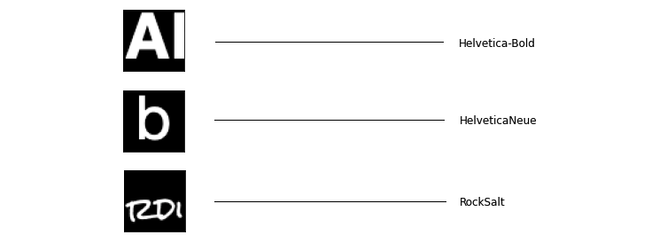
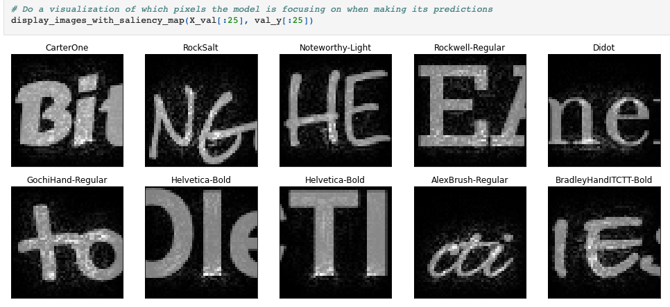

# Font from Image
## Supervised Learning - Learn Font names from text in an image

This is a cleaned up version of experimentations I did in 2018 after my [Deep Learning Specialization](https://www.coursera.org/specializations/deep-learning) with Andrew Ng in 2018.

Having played a lot with fonts and drawing texts on an image for my **[Mix on Pix](https://apps.apple.com/us/app/mix-on-pix-text-on-photos/id633281586)** app, I wanted to see
if it was possible to use Deep Learning to learn what is the font used in an image.  

So I created a 3 steps process:
1. Generate images that contain a text from a variety of fonts.
2. Do Extract-Transform-Load (ETL) preprocesing to have the data ready for Learning.
3. Train a model for classification to identify the font in an image.
 
---
After classification, I created an interesting Saliency Map

---
## Directories
- [data/font_data](data/font_data): The Dataset of 11,760 images. It is composed of:
  - 1 directory per Font. For each of the 35 fonts, we have:
    -  86 images with 1 character per image. 50px x 50px.
    -  250 images with 3 characters per image. 150px x 50px.
- [ImagesGeneration](ImagesGeneration): macOS application. This application generates images with text. Configurable.
- [notebooks](notebooks): Jupyter Notebooks for:
  - ETL to generate 29,260 50x50x1 images and labels. 
    - 35 *  (86 + (3 * 250)) = 29,260
  - Performs the actual training to identify the font in the text of an image.

---
## Communication

- If you want to contribute, submit a pull request.
- If you found a bug, have suggestions or need help, please, open an issue.

---

## Licenses
- The data: Font from Image (FFI) Dataset © 2022 by Francois Robert is licensed under CC BY 4.0. To view a copy of this license, visit http://creativecommons.org/licenses/by/4.0/.
- The code: The code in the notebooks and the macOS code to generate the images are licensed under the MIT license. See [here](notebooks/LICENSE.txt) and [here](ImagesGeneration/LICENSE.txt).
---
by Francois Robert

