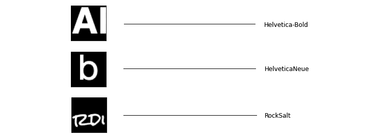

# FontFromImage
## Supervised Learning - Learn Font names from text in an image

This is a cleaned up version of experimentations I did in 2018 after my [Deep Learning Specialization](https://www.coursera.org/specializations/deep-learning) with Andrew Ng in 2018.

Having played a lot with fonts and drawing texts on an image for my **[Mix on Pix](https://apps.apple.com/us/app/mix-on-pix-text-on-photos/id633281586)** app, I wanted to see
if it was possible to use Deep Learning to learn what is the font used in an image.  

So I created a 3 steps process:
- Generate images that contain a text from a variety of fonts.
- Do ETL preprocesing to have the data ready for Learning.
- Train a model to identify the font in an image.

---
## Directories
- **ImagesGeneration**: MacOS application generated with Xcode. This application will generate images with text
- **ImagesProcessing**: Jupyter Notebook for preprocessing to generate 50 x 50 images and labels. **Note**: Also available from [here](https://nbviewer.jupyter.org/github/frobertpixto/font-from-image/blob/main/ImagesProcessing/pre_process_font_data.ipynb). 
- **Training**: Jupyter Notebook that performs the actual training. **Note**: Also available from [here](https://nbviewer.jupyter.org/github/frobertpixto/font-from-image/blob/main/Training/FontFromImage1.ipynb).

---
by Francois Robert 

