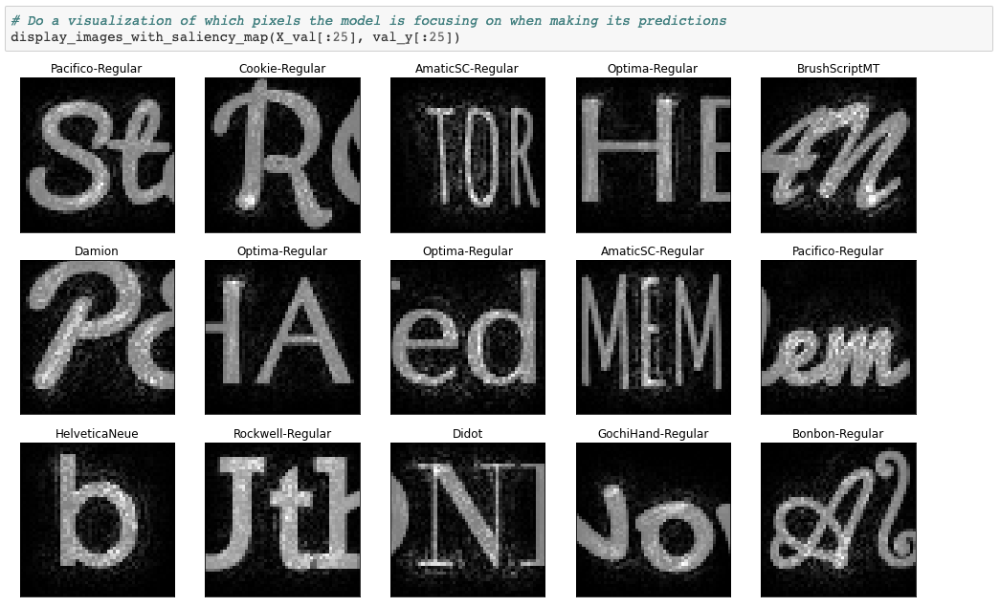

# FontFromImage
## Supervised Learning - Learn Font names from text in an image

This is a cleaned up version of experimentations I did in 2018 after my [Deep Learning Specialization](https://www.coursera.org/specializations/deep-learning) with Andrew Ng in 2018.

Having played a lot with fonts and drawing texts on an image for my **[Mix on Pix](https://apps.apple.com/us/app/mix-on-pix-text-on-photos/id633281586)** app, I wanted to see
if it was possible to use Deep Learning to learn what is the font used in an image.  

So I created a 3 steps process:
1. Generate images that contain a text from a variety of fonts.
2. Do Extract-Transform-Load (ETL) preprocesing to have the data ready for Learning.
3. Train a model for classification to identify the font in an image.
 
---
I also create an interesting Saliency Map

---
## Directories
- **data/font_data**: The Dataset of 29,050 50x50x1 images. Composed of:
  - 1 directory per Font. For each of the 35 fonts, we have:
    -  86 images with 1 character per image.
    -  250 images with 3 characters per image.
- **ImagesGeneration**: MacOS application generated with Xcode. This application will generate images with text. 
- **notebooks**: Jupyter Notebook for:
  - ETL to generate 29,050 50x50x1 images and labels. 
    - 35 *  (86 + (3 * 250)) = 29,260... not 29,050
  - Performs the actual training to identify the font in the text of an image.

---
by Francois Robert 

